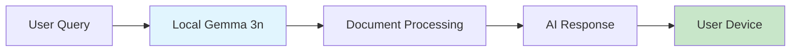
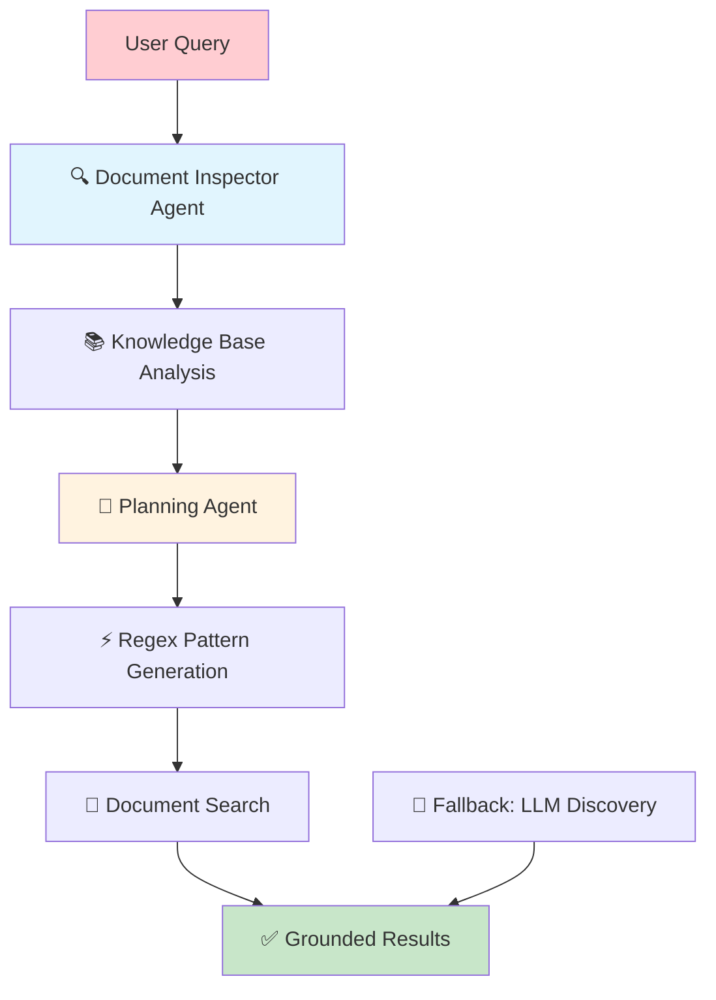

# 🚀 TimeCapsule-SLM
## *Revolutionizing Education & Open Learning with Gemma 3n*

---

### 🎯 **Executive Summary**

Just as coding agents have revolutionized the way developers write code, **TimeCapsuleSLM** is set to revolutionize the way we learn. Our platform is a comprehensive, open-source solution that combines AI-powered research and adaptive learning tools into a single, cohesive experience. 

> 💡 **Key Innovation**: By leveraging the on-device, completely offline capabilities of Gemma 3n, we're building a solution that creates meaningful, positive change, especially in underserved educational settings.

---

## 🌟 **Our Vision: Solving Open Learning**

In an era of fragmented information, learners and researchers face a common set of challenges:

### ❌ **Current Challenges**
- **Inefficient learning methods** lacking personalization
- **Privacy concerns** with cloud-based AI tools
- **Linear education** that doesn't adapt to individual needs
- **Manual content creation** burden on educators
- **Resource constraints** in low-connectivity environments

### ✅ **Our Solution**
> **Empower individuals and communities** with a powerful, accessible, and private AI platform that puts users in control of their data and learning journey.

TimeCapsuleSLM addresses these issues head-on by providing an **intelligent, offline-first solution** that works where it's needed most.

---

## 🚨 **The Critical Problem We're Solving**

### 📊 **The Global Education Crisis**

| Challenge | Impact | Our Solution |
|-----------|---------|--------------|
| 🌐 **Connectivity Barriers** | Limited access to quality resources | ⚡ Fully offline operation |
| 💰 **Economic Constraints** | Expensive hardware requirements | 🔧 Optimized for low-resource devices |
| 👥 **Poor Teacher-Student Ratios** | Lack of personalized attention | 🤖 AI-powered adaptive learning |
| 🔒 **Privacy Concerns** | Data sent to cloud servers | 🛡️ 100% on-device processing |

> **The Reality**: Current AI education tools require constant internet connectivity, expensive hardware, and cloud-based processing that compromises privacy. They fail precisely where they're needed most - in underserved communities with limited resources.

---

## 🔬 **How We Use Gemma 3n: A Technical Deep Dive**

TimeCapsuleSLM is built to leverage the unique capabilities of Google's **Gemma 3n model**, making it a powerful, privacy-first, and entirely offline solution.

### 🛡️ **On-Device Performance and Privacy**

**🔒 Core Privacy Principle**: At the core of our platform is the ability to run powerful AI models locally, completely offline.

> **Technical Implementation**: By integrating with Ollama, we serve Gemma 3n directly on a user's device. This aligns perfectly with Gemma 3n's design philosophy of on-device, private AI.

**✅ Privacy Guarantee**: All data processing for research, document indexing, and learning assistance happens locally, ensuring user data **never leaves their device**.

### ⚡ **Gemma 3n's Mix'n'Match for Optimized Performance**

We leverage Gemma 3n's innovative **"mix'n'match"** capability to dynamically optimize performance:

#### 🏗️ **Custom Model Development**
- **Model**: `Timecapsule2.7B-g3n-mix-match`
- **Repository**: [🤗 Hugging Face](https://huggingface.co/bubblspace/Timecapsule2.7B-g3n-mix-match)
- **Optimization**: Tailored memory footprint and processing speed
- **Target**: Highly efficient on resource-constrained devices

| Feature | Benefit | Impact |
|---------|---------|---------|
| 🧠 **Dynamic Memory** | Adjusts to device capabilities | Works on low-end hardware |
| ⚡ **Speed Optimization** | Faster response times | Better user experience |
| 🎯 **Task-Specific Tuning** | Optimized for educational content | Higher accuracy |

---

## 🧠 **Overcoming Technical Challenges: The Power of AI Agents**

### ❌ **The Problem with Traditional Approaches**

> **Challenge**: Traditional semantic search, while powerful, can often produce poor, ungrounded results in resource-constrained, offline environments.

**Our Insight**: True document analysis requires a smarter approach that can understand user intent and precisely extract relevant information from documents, not just provide loosely related text.

### 🤖 **Our Multi-Agent Solution**

**Inspiration**: We took inspiration from the success of coding agents and built a similar multi-agent system for learning and discovery, but one that is **grounded in actual document truth**.

### 🔄 **Our Three-Stage Process**

#### 1️⃣ **Document Inspector Agent**
- **Purpose**: Analyzes all available documents in the user's local Knowledge Base
- **Function**: Uses Gemma 3n to determine which specific documents are most relevant
- **Benefit**: Ensures subsequent search is targeted and efficient

#### 2️⃣ **Planning Agent & Regex Search**
- **Innovation**: Instead of resource-intensive semantic search, generates precise Regex patterns
- **Process**: Uses Gemma 3n to create patterns based on user query and document content
- **Execution**: Regex patterns run on raw text of chosen documents

#### 3️⃣ **Smart Fallback System**
- **Primary**: Highly precise Regex search
- **Fallback**: Gemma 3n's raw LLM discovery for open-ended queries
- **Result**: Always provides useful responses while prioritizing accuracy

### 🏆 **Key Advantages**

| Advantage | Traditional Search | Our Approach |
|-----------|-------------------|--------------|
| **🎯 Precision** | Loosely related results | Direct source extraction |
| **⚡ Speed** | Resource-intensive | Lightning-fast Regex |
| **🛡️ Privacy** | Cloud-dependent | 100% on-device |
| **📊 Truthfulness** | Potential hallucinations | Document-grounded truth |
| **💻 Resource Usage** | High computational cost | Optimized for low-resource devices |

> **Result**: This agentic behavior, powered by Gemma 3n, allows us to build a robust in-browser Knowledge Base that drives a powerful DeepResearch platform. Users can trust that insights are not only relevant but also **grounded in their own data**, all while being fast and private.

---

## 🌍 **The Impact: A New Paradigm for Learning**

### 🚀 **Democratizing Education Through Technology**

TimeCapsuleSLM represents a **significant step towards democratizing education and research**. By using Gemma 3n to bring powerful AI capabilities on-device and entirely offline, we've created a platform that empowers both teachers and students.

### 🎯 **Key Platform Features**

#### 📊 **AI-Frames System**
- **Transforms**: Passive content → Interactive, graphical learning experiences
- **Enables**: Visual, engaging educational content creation
- **Benefits**: Enhanced comprehension and retention

#### 🔬 **Multi-Agent Research System**
- **Provides**: Grounded, precise research outputs
- **Ensures**: Document-based truthfulness
- **Delivers**: Fast, reliable insights

### 💡 **Real-World Impact**

> **Most importantly**, our solution provides a **cost-effective, private, and accessible platform** for teachers and students in low-resource environments.

#### 🌟 **Transformative Benefits**

| Traditional Education | TimeCapsuleSLM |
|----------------------|----------------|
| 📍 **Location-dependent** | 🌐 **Works anywhere** |
| 🌐 **Requires internet** | ⚡ **Fully offline** |
| 💰 **Expensive hardware** | 💻 **Runs on basic devices** |
| 🔒 **Privacy concerns** | 🛡️ **Complete data privacy** |
| 📚 **Static content** | 🎮 **Interactive learning** |
| 👨‍🏫 **Teacher-dependent** | 🤖 **AI-assisted personalization** |

### 🎯 **Our Mission Statement**

> **We are enabling a future where quality education is not limited by location, connectivity, or access to expensive hardware.**

---

## 🏁 **Conclusion: The Future is Offline-First**

TimeCapsuleSLM, powered by **Gemma 3n**, represents more than just a technological advancement—it's a **paradigm shift** towards truly accessible, private, and effective education technology.

### 🔮 **Looking Forward**

- **🌱 Sustainable**: No cloud dependency = lower costs
- **🔒 Secure**: On-device processing = complete privacy
- **⚡ Scalable**: Works on any device, anywhere
- **🎯 Effective**: Grounded in real document truth
- **🌍 Inclusive**: Serves underserved communities first

> **The revolution in education isn't coming—it's here, it's offline, and it's powered by Gemma 3n.**

---

### 🔗 **Resources & Links**

- 🤗 **Custom Model**: [Timecapsule2.7B-g3n-mix-match](https://huggingface.co/bubblspace/Timecapsule2.7B-g3n-mix-match)
- 🌟 **Platform**: TimeCapsuleSLM - Open Source Educational AI
- 🎯 **Mission**: Solving Open Learning, One Device at a Time

---

*Built with ❤️ for educators and learners worldwide*

