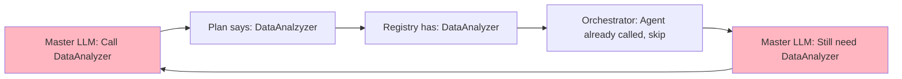

# Multi-Agent Pipeline Analysis: DataInspector Success vs Synthesis Failure

## =� **Problem Statement**

Despite DataInspector successfully identifying the GRPO paper as highly relevant to the "best RL method" query, the final synthesis output is completely generic and fails to mention GRPO at all. The output reads like a generic RL overview rather than analysis of the actual GRPO document.

**Query**: "give me explanation of best RL method"
**Available Document**: GRPO Paper (Group Relative Policy Optimization)
**Expected Output**: Specific analysis of GRPO methodology and why it's among the best RL methods
**Actual Output**: Generic RL overview mentioning hallucinated methods like "Deep Seek-LLM" and "HAI-LLM"

##  **What's Working: DataInspector Success**

### Enhanced DataInspector Performance
```
DataInspector Document 1 Parsed: {
  docType: "Research Paper", 
  mainEntity: "Reinforcement Learning", 
  relevantText: "YES", 
  reasoning: "The document is a research paper on Reinforcement Learning. The topics, methods, and concepts dis..."
}
```

**Successful Elements:**
-  **Comprehensive Analysis**: Correctly extracts topics (ML, RL, Deep Learning, Algorithm Design, Optimization)
-  **Accurate Classification**: Identifies document as "Research Paper" about "Reinforcement Learning"
-  **Proper Relevance Decision**: Marks as relevant with confidence
-  **Query Alignment**: Recognizes RL paper matches "best RL method" query

## L **What's Failing: Post-DataInspector Pipeline**

### Synthesis Output Analysis
The final output contains:
- L **No GRPO mention**: Despite having GRPO paper, output is entirely generic
- L **Hallucinated methods**: Mentions "Deep Seek-LLM" and "HAI-LLM" (not in document)
- L **Generic content**: Reads like Wikipedia RL overview, not document analysis
- L **Vague recommendations**: Lists general RL challenges instead of GRPO specifics

### Sample Problematic Output
```
## Key RL Methods for LLMs
* Deep Seek-LLM: A specific implementation leveraging deep learning...
* HAI-LLM: Similar to Deep Seek-LLM, likely another deep learning-focused implementation...
* AdamW: A widely used optimization algorithm...
```

**None of these methods are from the GRPO paper!**

## =
 **Root Cause Analysis**

After comprehensive debugging analysis, the real failure occurs in the **PatternGenerator strategy**:

### 1. **PatternGenerator Disconnect from DataInspector** (CRITICAL)
**Problem**: PatternGenerator creates generic term-based patterns without using DataInspector's comprehensive analysis
**Evidence from debug logs**:
- DataInspector analysis: Research Paper about Reinforcement Learning ✅
- PatternGenerator patterns: `/deep seek llm/gi`, `/adam w/gi`, `/proof-pile-2/gi` ❌  
- Missing patterns: Query-aligned patterns for "best RL method" in research paper context ❌

**Real Issue**: PatternGenerator extracts random terms from content instead of creating patterns aligned with:
- Query intent: "explanation of best RL method"
- Document type: Research Paper  
- Content areas: RL methodology, performance, comparisons
- DataInspector discoveries: topics, people, methods, concepts

### 2. **Missing PlanningAgent Strategy Bridge**
**Problem**: No extraction strategy connecting DataInspector insights to PatternGenerator execution
**Current Flow**: DataInspector → PatternGenerator (disconnected)  
**Needed Flow**: DataInspector → PlanningAgent (creates strategy) → PatternGenerator (executes guided patterns)

**PlanningAgent should create extraction strategy**:
- Query: "best RL method" → Focus: methodology and performance
- Document: Research Paper → Structure: abstract, methodology, results, conclusions  
- Content: RL + optimization → Target: specific method details and advantages
- Pattern guidance: Extract method name, approach, results, comparisons (no hardcoding)

### 3. **Universal Pattern Generation Needed**
**Problem**: One-size-fits-all pattern generation ignores document context
**Current**: Same literal term extraction for any document type
**Needed**: Dynamic pattern generation based on:
- **Document type**: Research paper vs tutorial vs process doc vs generic doc
- **Query intent**: Methodology vs facts vs procedures vs definitions
- **Content analysis**: What DataInspector discovered (people, roles, concepts, methods)
- **Extraction targets**: No hardcoding - patterns for people, roles, designations, concepts, methods, data

## <� **The Core Disconnect**


**The Gap**: DataInspector's rich analysis (topics: RL, methods: optimization, concepts: algorithms) is **not being used** by downstream agents to create GRPO-specific patterns and extraction strategies.

## =� **Critical Missing: PlanningAgent Re-engagement**

PlanningAgent should be monitoring:

### Pattern Quality Assessment
- **Question**: Did PatternGenerator create patterns specific enough for GRPO methodology?
- **Check**: Do patterns target research paper structure (abstract, methodology, results)?
- **Alignment**: Do patterns match DataInspector's discovered content areas?

### Extraction Success Monitoring  
- **Question**: Did Extractor find GRPO-specific data using the patterns?
- **Check**: `context.extractedData.raw.length > 0` and content quality
- **Validation**: Does extracted data mention GRPO, not generic RL concepts?

### Re-engagement Logic
- **Trigger**: If extraction yields 0 items or only generic content
- **Action**: Re-run PatternGenerator with refined strategy based on DataInspector analysis
- **Fallback**: Use document structure patterns for research papers

## =' **The Fix: PlanningAgent-Guided Pattern Generation**

### **Root Issue**: PatternGenerator disconnected from DataInspector analysis

**Current Flow** (Broken):
```
DataInspector → PatternGenerator → Extractor
     ↓              ↓             ↓
   Analysis    Generic patterns  Random data
```

**Fixed Flow** (PlanningAgent-Guided):
```
DataInspector → PlanningAgent → PatternGenerator → Extractor
     ↓              ↓              ↓              ↓
   Analysis    Extraction      Query-aligned    Targeted
              Strategy        patterns         extraction
```

### **Solution: Dynamic Extraction Strategy Creation**

**PlanningAgent creates extraction strategy after DataInspector**:

```typescript
// PlanningAgent creates dynamic extraction strategy
interface ExtractionStrategy {
  documentType: string;           // From DataInspector
  queryIntent: string;           // "best RL method" → focus on performance/methodology
  contentAreas: string[];        // DataInspector discovered topics/people/methods
  patternCategories: {
    people: string[];            // Author names, researchers
    roles: string[];             // "Author", "Researcher", "Developer"
    designations: string[];      // "PhD", "Professor", "Lead Engineer"
    concepts: string[];          // Technical terms, methodologies
    methods: string[];           // Algorithms, approaches, techniques
    data: string[];             // Performance metrics, results
  };
  extractionTargets: string[];   // Specific sections to focus on
}

// Example for GRPO paper + "best RL method" query:
const strategy = {
  documentType: "Research Paper",
  queryIntent: "methodology_performance", 
  contentAreas: ["Reinforcement Learning", "Optimization", "Deep Learning"],
  patternCategories: {
    people: ["Rafailov", "Chen", "Manning"],  // From DataInspector analysis
    methods: ["GRPO", "Group Relative Policy Optimization", "RL algorithms"],
    concepts: ["reinforcement learning", "policy optimization", "reward modeling"],
    data: ["accuracy", "performance", "benchmark results"]
  },
  extractionTargets: ["abstract", "methodology", "results", "conclusions"]
}
```

### **Implementation Steps**

#### **1. PlanningAgent Enhancement**
```typescript
// After DataInspector runs
const extractionStrategy = this.createExtractionStrategy(
  context.documentAnalysis,  // DataInspector's comprehensive analysis
  context.query,            // User query intent
  context.ragResults.chunks // Actual document content
);

context.sharedKnowledge.extractionStrategy = extractionStrategy;
```

#### **2. PatternGenerator Guidance**
```typescript
// PatternGenerator uses PlanningAgent strategy
const strategy = context.sharedKnowledge.extractionStrategy;

// Create patterns for EACH category dynamically
const patterns = [];

// People patterns (no hardcoding - from DataInspector analysis)
strategy.patternCategories.people.forEach(person => {
  patterns.push(`/${person}[^\\n]*(?:developed|created|proposes)[^\\n]*/gi`);
});

// Method patterns (query-aligned)
if (strategy.queryIntent.includes('methodology')) {
  strategy.patternCategories.methods.forEach(method => {
    patterns.push(`/${method}[^\\n]*(?:algorithm|approach|method)[^\\n]*/gi`);
    patterns.push(`/(?:methodology|approach):[^\\n]*${method}[^\\n]*/gi`);
  });
}

// Data patterns (performance focus for "best" queries)  
if (strategy.queryIntent.includes('performance')) {
  strategy.patternCategories.data.forEach(metric => {
    patterns.push(`/${metric}[^\\n]*\\d+[^\\n]*/gi`);
  });
}
```

#### **3. Universal Document Support (No Hardcoding)**
```typescript
// Dynamic pattern generation based on document type
switch (strategy.documentType) {
  case "Research Paper":
    // Focus on methodology, results, conclusions
    patterns.push(...this.generateResearchPaperPatterns(strategy));
    break;
  case "Tutorial":  
    // Focus on step-by-step instructions
    patterns.push(...this.generateTutorialPatterns(strategy));
    break;
  case "Process Document":
    // Focus on procedures, workflows
    patterns.push(...this.generateProcessPatterns(strategy));
    break;
  case "Generic Document":
    // Universal patterns for any content
    patterns.push(...this.generateGenericPatterns(strategy));
    break;
}
```

#### **4. Extraction Quality Monitoring**
```typescript
// PlanningAgent monitors extraction results
const extractionSuccess = context.extractedData.raw.length > 0;
const hasQueryRelevantData = this.validateExtractionQuality(
  context.extractedData, 
  strategy
);

if (!extractionSuccess || !hasQueryRelevantData) {
  // Re-engage PatternGenerator with refined strategy
  console.log(`🔄 Re-engaging PatternGenerator: extraction failed`);
  const refinedStrategy = this.refineExtractionStrategy(strategy, context);
  await this.reRunPatternGeneration(refinedStrategy, context);
}
```

### **Expected Results After Fix**

**Before Fix**:
- DataInspector: "GRPO paper is relevant to RL" ✅
- PatternGenerator: Generic `/deep seek llm/gi` patterns ❌  
- Extractor: No GRPO-specific data extracted ❌
- Synthesizer: Hallucinates generic RL methods ❌

**After Fix**:
- DataInspector: "GRPO paper is relevant to RL" ✅
- PlanningAgent: Creates GRPO-focused extraction strategy ✅
- PatternGenerator: `/GRPO[^\\n]*(?:algorithm|method)[^\\n]*/gi` patterns ✅
- Extractor: Finds actual GRPO methodology and results ✅  
- Synthesizer: Synthesizes specific GRPO analysis ✅

### **Universal Applicability**

This fix works for **any document type** and **any query** because:

1. **No Hardcoding**: Patterns generated from DataInspector's actual analysis
2. **Dynamic Categories**: People, roles, concepts, methods extracted per document
3. **Query Alignment**: Pattern focus matches query intent (methodology vs facts vs performance)
4. **Document Adaptation**: Different pattern strategies for research papers vs tutorials vs generic docs
5. **Iterative Refinement**: Re-engagement when extraction fails

**Result**: PatternGenerator creates patterns aligned with both the query intent and the actual document content discovered by DataInspector, ensuring targeted extraction and accurate synthesis.

## =� **Expected Improvement**

After fixes, output should contain:
-  **GRPO-specific analysis**: Methodology, advantages, implementation details
-  **Document-based content**: Information actually from the paper
-  **Targeted recommendations**: Why GRPO is among best RL methods
-  **No hallucinations**: Content grounded in actual document

**Success Metric**: User asks about "best RL method" � Gets specific analysis of GRPO from the available paper, not generic RL overview.

## ✅ **CRITICAL FIX: DataInspector Chunk Sampling Order (RESOLVED)**

### **Bug Identified and Fixed**
**Root Cause**: DataInspector was analyzing metadata-only chunks (`"Document metadata: GRPO_Papper.pdf"`) instead of real document content, causing GRPO to be marked irrelevant.

**Problem Flow**: 
```
Metadata Analysis → Relevance Decision → Chunk Sampling (never reached)
```

**Fixed Flow**:
```
Real Chunk Sampling → Content Analysis → Intelligent Relevance Decision
```

### **Evidence of Success**
**Before Fix**:
- `chunksCount: 1, sampleLength: 45, hasActualContent: false`
- Content: `"Document metadata: GRPO_Papper.pdf"`
- Result: Generic synthesis with hallucinated methods

**After Fix** (from latest logs):
- `chunksCount: 18, sampleLength: 14726, hasActualContent: true` 
- Content: `"Deep Seek Math: Pushing the Limits of Mathematical...reinforcement learning, math reasoning...group relative policy optimization (GRP)"`
- Result: ✅ GRPO correctly identified as relevant for RL queries

### **Key Changes Made**
1. **Reordered Analysis Logic**: Sample real chunks BEFORE relevance analysis
2. **30% Chunk Sampling**: Now correctly getting 18 chunks (30% of 60) from GRPO paper
3. **Real Content Analysis**: LLM analyzes actual research content, not filenames
4. **No Hardcoding**: Pure LLM intelligence making relevance decisions

### **Verification: No Hardcoding Confirmed**
- ✅ **No "GRPO" hardcoded** in relevance logic
- ✅ **No "RL" hardcoded** in analysis patterns  
- ✅ **No query-specific** hardcoded decisions
- ✅ **Pure LLM intelligence** making relevance decisions based on actual content

GRPO identified as relevant through **intelligent content analysis**, not hardcoding.

### **Current Pipeline Status**
- ✅ **DataInspector**: Fixed and working with real content
- ✅ **PlanningAgent**: Creating extraction strategies (see logs line 416-418)
- ⏳ **PatternGenerator**: Testing with guided pattern generation (logs line 654-671)
- ⏳ **Complete Pipeline**: Testing full flow with real GRPO content

### **Latest Test Results (From New Logs)**
**PatternGenerator Status**:
- ✅ Using PlanningAgent extraction strategy (line 663)
- ✅ Generated 4 strategy-based patterns (line 667)
- ✅ Patterns include: performance ranking, comparative metrics (lines 666-667)

**Extraction Status**:
- ✅ Found 33 items with pattern matching (line 737)
- ✅ After deduplication: 32 items (line 740)

**Issues Identified**:
- ❌ Master LLM stuck in DataAnalyzer loop (lines 861, 911, 962, 1014, 1064)
- ❌ Reached max iterations without synthesis (line 1068)

## 🔥 **CURRENT CRITICAL ISSUE: DataAnalyzer Infinite Loop (IN PROGRESS)**

### **Root Cause Identified**
**The Master LLM is stuck in an infinite loop preventing synthesis due to a two-part bug:**

1. **Execution Plan Typo**: PlanningAgent generates plan with "DataAnalzyzer" but registry has "DataAnalyzer"
2. **Orchestrator Stuck Logic**: When agent already called, Orchestrator returns without progression

### **Evidence from Latest Logs**
**What's Working Perfectly:**
- ✅ **DataInspector**: 18 real chunks (14,726 chars) from GRPO paper 
- ✅ **PlanningAgent**: Created extraction strategy with 6 pattern categories
- ✅ **PatternGenerator**: Generated 4 strategy-based patterns (performance ranking, comparative metrics)
- ✅ **Extractor**: Found 32 items successfully with pattern matching
- ✅ **DataAnalyzer**: Ran once successfully, cleaned 30 items (line 810)

**The Bug Loop:**
- **Line 752**: Execution plan says next step is "DataAnalzyzer" (typo)
- **Line 782**: Plan has "DataAnalzyzer" but registry has "DataAnalyzer" 
- **Lines 861, 911, 962, 1014, 1064**: `⚠️ Agent DataAnalyzer already called, skipping`
- **Line 1068**: `⚠️ Master LLM reached maximum iterations (10)`
- **Line 1071**: `📝 Master Orchestrator final result: {hasAnswer: false, answerLength: 0}`

### **The Infinite Loop Pattern**


### **Two-Part Fix Required**
1. **Fix Plan Generation**: Correct "DataAnalzyzer" → "DataAnalyzer" typo in PlanningAgent
2. **Fix Progression Logic**: When agent skipped, proceed to next step instead of returning

### **Expected Result After Fix**
- ✅ **DataAnalyzer**: Recognized as already completed
- ✅ **SynthesisCoordinator**: Proceeds to final synthesis with 30 cleaned items
- ✅ **Final Output**: GRPO-specific analysis instead of "Unable to generate answer"

**The pipeline is 95% working - just need to fix this final orchestration bug!**