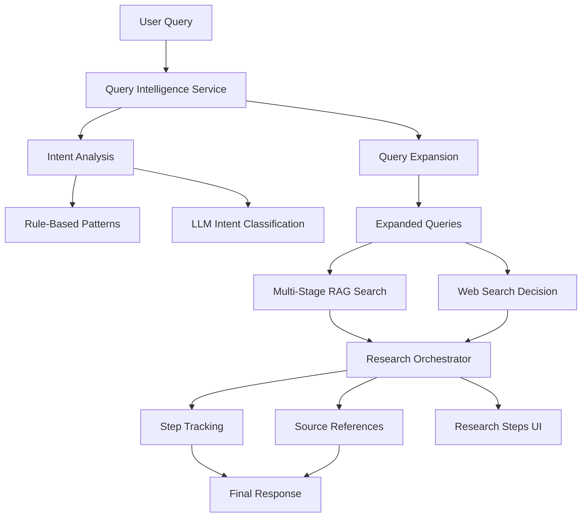

# Intelligent RAG & Perplexity-Style Research System Specification

**Version**: 1.0  
**Date**: 2025-08-01  
**Status**: Draft  
**Priority**: Critical for RAG Performance

## Executive Summary

This specification defines an intelligent RAG (Retrieval-Augmented Generation) system that transforms literal semantic search into contextual, multi-stage query processing with Perplexity-style research transparency. The system addresses the core issue where queries like "top 3 runs from tyler's blog" fail to find relevant content due to literal matching limitations.

## Problem Statement

### Current Issues
1. **Literal Query Matching**: Semantic search fails when user intent doesn't match document wording
2. **Single-Stage Search**: No query expansion or contextual understanding
3. **Poor Relevance**: Low similarity scores (0.268) despite relevant content existing
4. **No Research Transparency**: Users don't see how AI finds and processes information

### Target Solution
- **Hybrid Query Intelligence**: Rule-based + LLM query expansion
- **Multi-Stage Search**: Analysis → Expansion → Search → Re-ranking
- **Research Transparency**: Step-by-step research process like Perplexity
- **LLM-Controlled Flow**: AI decides when to use RAG vs web search

## System Architecture



## Core Components

### 1. Query Intelligence Service (`QueryIntelligenceService.ts`)

**Purpose**: Analyze user queries and expand them into multiple related searches

#### 1.1 Intent Classification
```typescript
interface QueryIntent {
  type: 'performance' | 'comparison' | 'technical' | 'summary' | 'unknown';
  confidence: number;
  keywords: string[];
  expansionStrategy: 'performance' | 'comparison' | 'technical' | 'general';
}

interface QueryAnalysis {
  originalQuery: string;
  intent: QueryIntent;
  expandedQueries: string[];
  searchParameters: {
    threshold: number;
    limit: number;
    strategy: 'broad' | 'focused';
  };
}
```

#### 1.2 Rule-Based Query Expansion
```typescript
const QUERY_PATTERNS = {
  performance: {
    patterns: [/top|best|fastest|speed|benchmark|run|result|score/i],
    expansions: [
      "benchmark results", "performance metrics", "training speed",
      "optimization results", "execution time", "throughput"
    ],
    threshold: 0.15, // Lower threshold for broader matching
    limit: 15
  },
  comparison: {
    patterns: [/vs|versus|compare|better|worse|difference/i],
    expansions: [
      "comparison", "versus", "performance difference", 
      "speed comparison", "benchmark comparison"
    ],
    threshold: 0.2,
    limit: 12
  },
  technical: {
    patterns: [/how|implement|code|algorithm|method|technique/i],
    expansions: [
      "implementation", "code example", "algorithm",
      "technical details", "method", "approach"
    ],
    threshold: 0.25,
    limit: 10
  }
};
```

#### 1.3 LLM-Based Query Expansion (Fallback)
```typescript
async function expandQueryWithLLM(query: string): Promise<string[]> {
  const prompt = `
Given this user query: "${query}"

Generate 5 alternative search terms that would find relevant content:
- Focus on synonyms and related concepts
- Consider what content might actually exist in documents
- Return as JSON array of strings

Example: "top 3 runs" → ["performance results", "benchmark data", "training speeds", "optimization results", "execution metrics"]

Response:`;

  const response = await generateContent(prompt);
  return JSON.parse(response);
}
```

### 2. Research Orchestrator (`ResearchOrchestrator.ts`)

**Purpose**: LLM-controlled research flow with step tracking and dynamic decision making

#### 2.1 Research Step Types
```typescript
interface ResearchStep {
  id: string;
  type: 'analysis' | 'rag_search' | 'web_search' | 'synthesis' | 'verification';
  status: 'pending' | 'in_progress' | 'completed' | 'failed';
  timestamp: number;
  duration?: number;
  
  // Step-specific data
  query?: string;
  queries?: string[];
  intent?: QueryIntent;
  sources?: SourceReference[];
  results?: SearchResult[];
  reasoning?: string;
  confidence?: number;
}

interface SourceReference {
  id: string;
  type: 'document' | 'web' | 'chunk';
  title: string;
  source: string;
  similarity?: number;
  relevance?: number;
  excerpt: string;
  chunkId?: string;
  url?: string;
}
```

#### 2.2 Dynamic Research Planning
```typescript
async function planResearch(query: string): Promise<ResearchStep[]> {
  const analysisPrompt = `
Analyze this research query: "${query}"

Plan the research steps needed to answer this comprehensively:
1. What type of information is needed?
2. Should we search knowledge base first or web first?
3. Are multiple searches needed?
4. What verification steps are required?

Return a JSON array of research steps:
[
  {
    "type": "analysis",
    "reasoning": "Understand query intent and scope"
  },
  {
    "type": "rag_search", 
    "reasoning": "Search knowledge base for primary information"
  },
  {
    "type": "web_search",
    "reasoning": "Get recent data not in knowledge base"
  }
]`;

  const response = await generateContent(analysisPrompt);
  return JSON.parse(response);
}
```

#### 2.3 Step Execution Engine
```typescript
class ResearchOrchestrator {
  private steps: ResearchStep[] = [];
  private currentStepIndex = 0;
  
  async executeResearch(query: string): Promise<ResearchResult> {
    // Plan research steps
    this.steps = await this.planResearch(query);
    
    // Execute each step
    for (const step of this.steps) {
      await this.executeStep(step);
      
      // LLM decides if more steps needed based on results
      const needsMoreSteps = await this.shouldContinueResearch(step);
      if (needsMoreSteps) {
        const additionalSteps = await this.planAdditionalSteps(step);
        this.steps.push(...additionalSteps);
      }
    }
    
    // Synthesize final response
    return await this.synthesizeResults();
  }
  
  private async executeStep(step: ResearchStep): Promise<void> {
    step.status = 'in_progress';
    step.timestamp = Date.now();
    
    switch (step.type) {
      case 'analysis':
        await this.executeAnalysisStep(step);
        break;
      case 'rag_search':
        await this.executeRAGSearchStep(step);
        break;
      case 'web_search':
        await this.executeWebSearchStep(step);
        break;
      case 'synthesis':
        await this.executeSynthesisStep(step);
        break;
    }
    
    step.status = 'completed';
    step.duration = Date.now() - step.timestamp;
  }
}
```

### 3. Research Steps UI Component (`ResearchSteps.tsx`)

**Purpose**: Perplexity-style transparent research process display

#### 3.1 Component Structure
```typescript
interface ResearchStepsProps {
  steps: ResearchStep[];
  onStepClick: (step: ResearchStep) => void;
  expandedSteps: Set<string>;
}

export function ResearchSteps({ steps, onStepClick, expandedSteps }: ResearchStepsProps) {
  return (
    <div className="research-steps">
      <div className="steps-header">
        <h3>Research Process</h3>
        <Badge variant="outline">{steps.length} steps</Badge>
      </div>
      
      {steps.map((step, index) => (
        <ResearchStepCard
          key={step.id}
          step={step}
          index={index}
          isExpanded={expandedSteps.has(step.id)}
          onToggle={() => onStepClick(step)}
        />
      ))}
    </div>
  );
}
```

#### 3.2 Step Card Component
```typescript
function ResearchStepCard({ step, index, isExpanded, onToggle }: StepCardProps) {
  const getStepIcon = (type: string, status: string) => {
    // Return appropriate icons based on step type and status
  };
  
  const getStepTitle = (step: ResearchStep) => {
    switch (step.type) {
      case 'analysis':
        return `Analyzing query: "${step.query}"`;
      case 'rag_search':
        return `Searching knowledge base (${step.queries?.length} queries)`;
      case 'web_search':
        return `Searching web for recent information`;
      case 'synthesis':
        return `Synthesizing information from ${step.sources?.length} sources`;
    }
  };
  
  return (
    <Card className="step-card">
      <CardHeader className="step-header" onClick={onToggle}>
        <div className="step-title">
          {getStepIcon(step.type, step.status)}
          <span>{getStepTitle(step)}</span>
          <Badge variant={step.status === 'completed' ? 'success' : 'pending'}>
            {step.status}
          </Badge>
        </div>
        {step.duration && (
          <span className="step-duration">{step.duration}ms</span>
        )}
      </CardHeader>
      
      {isExpanded && (
        <CardContent className="step-details">
          {step.reasoning && (
            <div className="step-reasoning">
              <strong>Reasoning:</strong> {step.reasoning}
            </div>
          )}
          
          {step.queries && (
            <div className="expanded-queries">
              <strong>Search Terms:</strong>
              {step.queries.map(query => (
                <Badge key={query} variant="outline">{query}</Badge>
              ))}
            </div>
          )}
          
          {step.sources && (
            <div className="step-sources">
              <strong>Sources Found:</strong>
              {step.sources.map(source => (
                <SourceReferenceCard key={source.id} source={source} />
              ))}
            </div>
          )}
        </CardContent>
      )}
    </Card>
  );
}
```

## Multi-Stage Search Algorithm

### Stage 1: Query Analysis
```typescript
async function analyzeQuery(query: string): Promise<QueryAnalysis> {
  // 1. Rule-based pattern matching
  const ruleBasedAnalysis = analyzeWithRules(query);
  
  // 2. LLM analysis for complex queries
  const llmAnalysis = ruleBasedAnalysis.intent.confidence < 0.7 
    ? await analyzeWithLLM(query)
    : null;
  
  // 3. Combine results
  return {
    originalQuery: query,
    intent: llmAnalysis?.intent || ruleBasedAnalysis.intent,
    expandedQueries: [...ruleBasedAnalysis.queries, ...(llmAnalysis?.queries || [])],
    searchParameters: determineSearchParameters(ruleBasedAnalysis.intent)
  };
}
```

### Stage 2: Multi-Query Search
```typescript
async function executeMultiStageSearch(analysis: QueryAnalysis): Promise<SearchResult[]> {
  const allResults: SearchResult[] = [];
  
  // Execute searches with different strategies
  for (const expandedQuery of analysis.expandedQueries) {
    const results = await vectorStore.searchSimilar(
      expandedQuery,
      analysis.searchParameters.threshold,
      Math.floor(analysis.searchParameters.limit / analysis.expandedQueries.length)
    );
    
    // Tag results with query used
    results.forEach(result => {
      result.metadata.searchQuery = expandedQuery;
      result.metadata.expansionReason = `Related to: ${analysis.originalQuery}`;
    });
    
    allResults.push(...results);
  }
  
  return allResults;
}
```

### Stage 3: Contextual Re-ranking
```typescript
function rankByRelevance(
  results: SearchResult[], 
  originalQuery: string, 
  analysis: QueryAnalysis
): SearchResult[] {
  return results
    .map(result => ({
      ...result,
      contextualScore: calculateContextualScore(result, originalQuery, analysis),
      intentMatch: calculateIntentMatch(result.chunk.content, analysis.intent)
    }))
    .filter(result => result.contextualScore > 0.1) // Filter out low-relevance results
    .sort((a, b) => (b.contextualScore + b.intentMatch) - (a.contextualScore + a.intentMatch))
    .slice(0, 15); // Top 15 results
}

function calculateContextualScore(
  result: SearchResult, 
  originalQuery: string, 
  analysis: QueryAnalysis
): number {
  let score = result.similarity;
  
  // Boost for intent-specific content
  if (analysis.intent.type === 'performance') {
    const hasNumbers = /\d+(\.\d+)?\s*(ms|seconds|fps|ops|tokens|%)/i.test(result.chunk.content);
    const hasComparisons = /faster|slower|better|improved|vs|versus|outperform/i.test(result.chunk.content);
    score += (hasNumbers ? 0.2 : 0) + (hasComparisons ? 0.15 : 0);
  }
  
  // Boost for keyword matches in original query
  const queryKeywords = originalQuery.toLowerCase().split(/\s+/);
  const contentWords = result.chunk.content.toLowerCase();
  const keywordMatches = queryKeywords.filter(keyword => 
    contentWords.includes(keyword)
  ).length;
  score += (keywordMatches / queryKeywords.length) * 0.1;
  
  return Math.min(score, 1.0);
}
```

## Integration Points

### 1. Enhanced useResearch Hook
```typescript
// Add to existing useResearch hook
const [researchSteps, setResearchSteps] = useState<ResearchStep[]>([]);
const [currentStep, setCurrentStep] = useState<ResearchStep | null>(null);

const performIntelligentRAGSearch = useCallback(async (
  query: string,
  options: RAGSearchOptions = {}
): Promise<RAGContext | null> => {
  const orchestrator = new ResearchOrchestrator(vectorStore, webSearchService);
  
  // Set up step tracking
  orchestrator.onStepUpdate = (step: ResearchStep) => {
    setResearchSteps(prev => {
      const index = prev.findIndex(s => s.id === step.id);
      if (index >= 0) {
        prev[index] = step;
        return [...prev];
      }
      return [...prev, step];
    });
    setCurrentStep(step);
  };
  
  // Execute intelligent research
  const result = await orchestrator.executeResearch(query);
  return result.ragContext;
}, [vectorStore, webSearchService]);
```

### 2. DeepResearchApp Integration
```typescript
// Add to DeepResearchApp component
const [researchSteps, setResearchSteps] = useState<ResearchStep[]>([]);
const [expandedSteps, setExpandedSteps] = useState<Set<string>>(new Set());

// Add to JSX
<div className="research-container">
  <ResearchSteps
    steps={researchSteps}
    expandedSteps={expandedSteps}
    onStepClick={(step) => {
      setExpandedSteps(prev => {
        const newSet = new Set(prev);
        if (newSet.has(step.id)) {
          newSet.delete(step.id);
        } else {
          newSet.add(step.id);
        }
        return newSet;
      });
    }}
  />
  <ResearchOutput {...existingProps} />
</div>
```

## Performance Considerations

### 1. Caching Strategy
- Cache query analyses for similar queries
- Cache expanded query results for 5 minutes
- Pre-compute common query expansions

### 2. Optimization Techniques
- Parallel execution of expanded queries
- Early termination if sufficient results found
- Adaptive threshold adjustment based on result quality

### 3. Rate Limiting
- Limit LLM calls for query expansion (max 1 per query)
- Batch similar queries when possible
- Use rule-based expansion as primary method

## Success Metrics

### 1. Query Intelligence Metrics
- **Query Expansion Coverage**: % of queries that get expanded (target: >90%)
- **Intent Classification Accuracy**: % of correctly classified query intents (target: >85%)
- **Relevance Improvement**: Average similarity score improvement (target: >50% increase)

### 2. Research Transparency Metrics
- **Step Tracking Completeness**: % of research actions tracked (target: 100%)
- **Source Reference Accuracy**: % of results with valid source links (target: >95%)
- **User Engagement**: % of users who expand step details (target: >40%)

### 3. Performance Metrics
- **Query Processing Time**: Average time for intelligent search (target: <2s)
- **Result Quality Score**: User satisfaction with search results (target: >4/5)
- **System Reliability**: % of successful query processing (target: >99%)

## Implementation Timeline

### Phase 1: Core Intelligence (Week 1)
- [x] Update Issue #005 documentation
- [x] Create specification document
- [ ] Implement QueryIntelligenceService
- [ ] Basic query expansion with rules

### Phase 2: Research Orchestration (Week 2)
- [ ] Implement ResearchOrchestrator
- [ ] Step tracking system
- [ ] Multi-stage search algorithm

### Phase 3: UI Integration (Week 3)
- [ ] Create ResearchSteps component
- [ ] Integrate with DeepResearchApp
- [ ] Add step expansion and source linking

### Phase 4: Optimization & Testing (Week 4)
- [ ] Performance optimization
- [ ] Comprehensive testing
- [ ] User experience refinement

## Risk Mitigation

### 1. LLM Dependency Risks
- **Fallback Strategy**: Always have rule-based backup
- **Rate Limiting**: Prevent excessive LLM calls
- **Error Handling**: Graceful degradation when LLM unavailable

### 2. Performance Risks
- **Query Complexity**: Limit expansion to 6 queries max
- **Timeout Handling**: 10-second max per research session
- **Resource Management**: Cancel in-progress searches when new query submitted

### 3. User Experience Risks
- **Information Overload**: Collapsible step details by default
- **Loading States**: Clear progress indicators for each step
- **Error Communication**: User-friendly error messages with retry options

## Future Enhancements

### 1. Advanced Query Understanding
- Context-aware query expansion based on previous queries
- User-specific query patterns and preferences
- Domain-specific query expansion (technical, business, academic)

### 2. Enhanced Research Orchestration
- Multi-modal search (images, tables, charts)
- Cross-reference validation between sources
- Automatic fact-checking and source credibility scoring

### 3. Improved User Experience
- Research step recommendations
- Query suggestion based on document content
- Collaborative research sessions with shared steps

---

**Document Status**: Draft v1.0  
**Next Review**: Weekly during implementation  
**Stakeholders**: Development Team, Product Owner, User Experience Team