# RAG (Retrieval-Augmented Generation) Integration

## Overview

RAG (Retrieval-Augmented Generation) is fully integrated throughout the Learning Deep Research system, providing evidence-based, personalized research by combining AI generation with relevant document retrieval from your knowledge base.

## 🏗️ RAG System Architecture

```mermaid
graph TD
    A[Learning Research Request] --> B[Extract Topics & Goals]
    B --> C[Search Knowledge Base]
    B --> D[Get Attached Documents]
    C --> E[Retrieve Relevant Chunks]
    D --> F[Full Document Content]
    E --> G[Multi-Agent Processing]
    F --> G
    G --> H[Analysis Agent + RAG Context]
    G --> I[Content Agent + RAG Context]  
    G --> J[Exercise Agent + RAG Context]
    G --> K[Integration Agent]
    K --> L[Final Learning Curriculum]
    
    subgraph "Knowledge Base"
        M[📄 User Documents]
        N[🔍 Scraped Content]
        O[🎓 AI-Frames]
        P[📝 Research History]
        Q[⚙️ System Content]
    end
    
    C --> M
    C --> N
    C --> O
    C --> P
    C --> Q
```



## 🔍 RAG Integration Layers

### 1. **Multi-Agent Learning Research** (Primary Path)

When using Learning research type, the system implements sophisticated RAG:

- **Attached Documents**: Users can specifically attach documents for learning research
- **Agent Coordination**: Each of 4 specialized agents receives attached documents as context
- **Vector Search**: Automatically searches knowledge base for relevant content
- **Context Integration**: Combines multiple document sources for comprehensive learning

```typescript
// From AgentCoordinator.ts
async generateLearningResearch(
  conversationContent: string,
  attachedDocuments: DocumentData[], // ✅ RAG integration
  researchDepth: 'overview' | 'detailed' | 'comprehensive'
)
```

### 2. **Knowledge Base RAG Search** (Automatic)

The system automatically performs semantic search across your knowledge base:

- **Semantic Search**: Uses vector embeddings for similarity matching
- **Topic-Based Retrieval**: Searches based on research topics
- **Similarity Scoring**: Returns most relevant content with confidence scores
- **Multi-Document**: Combines multiple sources intelligently

```typescript
// RAG Search Implementation
private async searchRelevantDocuments(selectedTopics: Topic[]): Promise<any[]> {
  for (const topic of selectedTopics) {
    const searchQuery = `${topic.title} ${topic.description}`;
    const results = await this.vectorStore.searchSimilar(searchQuery, 0.1, 10);
    // Returns relevant document chunks with similarity scores
  }
}
```

### 3. **Learning-Specific RAG Prompt Integration**

Learning research prompts specifically integrate RAG context:

```typescript
// Enhanced Learning Prompts with RAG
private async buildLearningResearchPrompt(
  selectedTopics: Topic[],
  depth: ResearchDepth,
  relevantDocuments: any[] // ✅ Knowledge Base RAG results
): Promise<string> {
  
  // Add RAG context if documents are available
  if (relevantDocuments.length > 0) {
    prompt += `## Supporting Learning Materials:\n`;
    relevantDocuments.forEach((result, index) => {
      const matchPercentage = (result.similarity * 100).toFixed(1);
      prompt += `### Document ${index + 1}: "${result.document.title}" (${matchPercentage}% match)\n`;
    });
  }

  // Add attached documents if available
  if (this.attachedDocuments.length > 0) {
    prompt += `## Attached Reference Documents:\n`;
    prompt += `**Important:** Use these attached documents as primary reference materials`;
  }
}
```

## 📚 Document Sources for RAG

Your learning research can pull from multiple knowledge sources:

| Source Type | Description | Priority |
|-------------|-------------|----------|
| 📄 **User Documents** | Files you upload (PDFs, text files, etc.) | High |
| 📎 **Attached Documents** | Specifically selected for learning research | Highest |
| 🔍 **Scraped Content** | Web content via Firecrawl integration | Medium |
| 🎓 **AI-Frames** | Learning content from AI-Frames system | Medium |
| 📝 **Research History** | Previous research outputs | Low |
| ⚙️ **System Content** | TimeCapsules, metadata | Lowest |

## 🎯 How to Use RAG with Learning Research

### **Method 1: Attach Specific Documents**
1. In Learning Research Input section, click **"📎 Attach Documents"**
2. Select specific user documents from your knowledge base
3. These become **primary reference materials** for the learning curriculum

### **Method 2: Automatic Knowledge Base Search**  
1. System automatically searches all your documents
2. Finds content relevant to your learning topics
3. Includes context from similar conversations and materials

### **Method 3: Combined Approach**
- **Attached documents** = Primary references with high priority
- **Knowledge base search** = Additional supporting context
- **AI-Frames content** = Related learning materials (if available)

## 🔬 RAG Processing Flow

1. **Request Analysis**: Extract learning goals and topics
2. **Document Retrieval**: Search knowledge base + get attached documents
3. **Context Assembly**: Combine relevant chunks with full document content
4. **Multi-Agent Processing**: Each AI agent receives RAG context
5. **Content Generation**: Evidence-based learning curriculum creation
6. **Result Integration**: Cohesive output with citations and references

## ✅ RAG Features Active

- ✅ **Vector Search**: Semantic similarity matching with 384-dimensional embeddings
- ✅ **Document Chunking**: Intelligent content segmentation for optimal retrieval
- ✅ **Multi-Document**: Combines multiple sources intelligently
- ✅ **Citation Support**: References with similarity scores and document IDs
- ✅ **Learning-Optimized**: Specialized prompts for educational content
- ✅ **Multi-Agent**: Each AI agent gets comprehensive RAG context
- ✅ **Real-time**: Documents processed and searchable immediately
- ✅ **Personalized**: Tailored to your specific knowledge base and attachments

## 🧠 Vector Store Implementation

The RAG system uses advanced vector embeddings:

- **Model**: Xenova/all-MiniLM-L6-v2 (384 dimensions)
- **Similarity Threshold**: Configurable (default 0.1 for broad matching)
- **Chunk Size**: 500 words per chunk with overlap
- **Search Limit**: Top 20 most relevant results
- **Processing**: Real-time embedding generation and storage

## 📊 RAG Performance Metrics

From your logs, the system shows excellent performance:

- **Knowledge Base**: 15 documents, 1.8 MB total, 62 searchable chunks
- **Processing Speed**: ~1-2 seconds per embedding generation
- **Multi-Agent Coordination**: 4 specialized agents working in parallel
- **Content Quality**: Integration agent produces comprehensive curricula
- **Auto-Save**: Research and agent logs automatically saved to knowledge base

## 🔧 Technical Implementation

### Vector Store Integration
```typescript
export class VectorStore {
  // Semantic search with similarity scoring
  async searchSimilar(query: string, threshold: number, limit: number): Promise<SearchResult[]>
  
  // Document processing with chunking
  async addDocument(document: DocumentData): Promise<void>
  
  // Real-time embedding generation
  private async generateEmbeddings(texts: string[]): Promise<number[][]>
}
```

### Agent Context Assembly
```typescript
// Each agent receives comprehensive context
private async buildAgentPrompt(
  spec: AgentSpec,
  conversationContent: string,
  attachedDocuments: DocumentData[], // Attached docs
  previousResults: Map<string, string>  // Other agents' outputs
): Promise<string>
```

The RAG integration ensures your learning research is **evidence-based**, **personalized**, and **comprehensive** by leveraging your entire knowledge base alongside specifically selected reference materials! 🚀
