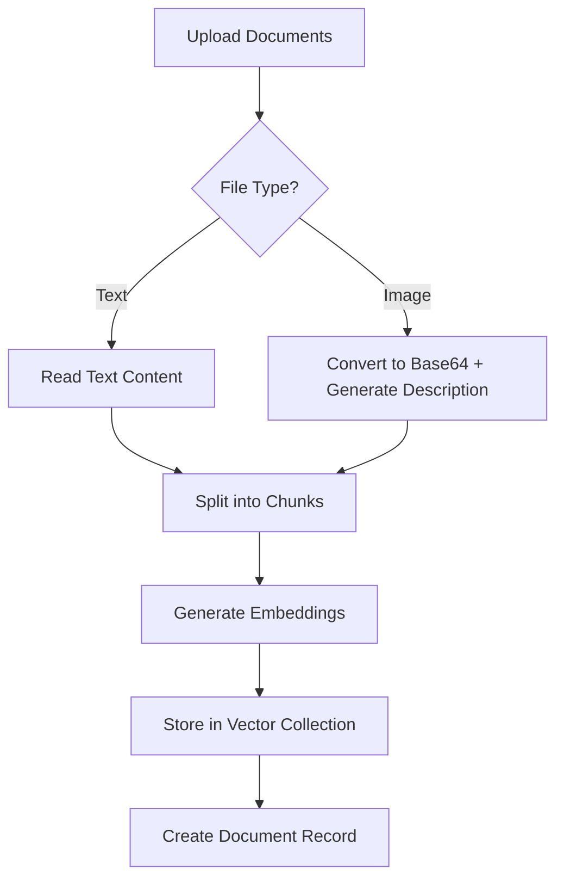

# Local Vector Store Architecture for DeepResearch

## Overview

This document describes the comprehensive local vector store implementation for the DeepResearch application, built using **RxDB with IndexedDB** and transformers.js to provide a full RAG (Retrieval-Augmented Generation) pipeline that runs entirely in the browser.

## Recent Updates (v4.0.0)

### **Major Architecture Changes:**
- ✅ **Migrated from localStorage to RxDB + IndexedDB** for scalable persistent storage
- ✅ **Implemented memory-safe processing** with 50-chunk limits and yield control
- ✅ **Added word-based chunking** (500 words per chunk) following reference implementation
- ✅ **Enhanced error handling** with graceful degradation for large files
- ✅ **Added comprehensive logging** matching original HTML implementation patterns
- ✅ **Implemented TimeCapsule export/import** for complete data portability

## Architecture Components

### 1. Vector Store Core (`VectorStore.ts`)

The `VectorStore` class provides a complete local-first database solution built on **RxDB with Dexie storage adapter** for IndexedDB persistence.

#### Key Features:
- **Local Embeddings**: Uses transformers.js with Xenova/all-MiniLM-L6-v2 model (npm package)
- **Persistent Storage**: RxDB with IndexedDB for unlimited scalable storage
- **Memory Management**: 10MB file limits, 50-chunk maximum, yield control every 5 chunks
- **Word-Based Chunking**: 500 words per chunk with smart content preservation
- **Semantic Search**: Vector similarity search with cosine similarity
- **Real-time Processing**: Automatic embedding generation with progress tracking

### 2. RxDB Collection Structure

The vector store uses **RxDB collections** with IndexedDB persistence for scalable document storage:

```typescript
// RxDB Schema Implementation
const documentsSchema = {
  version: 0,
  primaryKey: 'id',
  type: 'object',
  properties: {
    id: { type: 'string' },
    title: { type: 'string' },
    content: { type: 'string' },
    metadata: { type: 'object' },
    chunks: { type: 'array' },
    vectors: { type: 'array' }
  },
  required: ['id', 'title', 'content', 'metadata', 'chunks', 'vectors']
}
```

#### Documents Collection (RxDB)
```typescript
interface DocumentData {
  id: string;                    // 'doc_timestamp_random' or 'gen_timestamp_random'
  title: string;                 // Display name/filename
  content: string;               // Full document content
  metadata: {
    filename: string;            // Original filename
    filesize: number;            // File size in bytes
    filetype: string;            // MIME type
    uploadedAt: string;          // ISO timestamp
    source: 'upload' | 'generated'; // Document origin
    description: string;         // Auto-generated description
    isGenerated: boolean;        // Generated vs uploaded
  };
  chunks: Array<{               // Word-based chunks (500 words each)
    id: string;                 // 'chunk_timestamp_index_random'
    content: string;            // Chunk text content
    startIndex: number;         // Character start position
    endIndex: number;           // Character end position
  }>;
  vectors: Array<{              // Embedding vectors for chunks
    chunkId: string;            // Reference to chunk.id
    embedding: number[];        // 384-dimensional vector array
  }>;
}
```

#### Vectors Collection
```javascript
{
  id: 'vec_documentId_chunkIndex',
  documentId: 'doc_id',
  content: 'chunk of text that was embedded...',
  embedding: [0.1, 0.2, -0.3, ...], // 384-dimensional vector
  chunkIndex: 0,
  // Index fields for fast similarity search (optional optimization)
  idx0: 0.123,
  idx1: 0.456,
  idx2: 0.789,
  idx3: 0.012,
  idx4: 0.345,
  createdAt: '2024-01-01T00:00:00.000Z'
}
```

#### Images Collection
```javascript
{
  id: 'img_documentId',
  name: 'image.jpg',
  documentId: 'doc_id',
  blob: 'data:image/jpeg;base64,...', // Base64 encoded image
  mimeType: 'image/jpeg',
  size: 1048576,
  width: 1920,
  height: 1080,
  description: 'AI-generated description for search',
  createdAt: '2024-01-01T00:00:00.000Z'
}
```

#### Repositories Collection
```javascript
{
  id: 'repo_timestamp_random',
  name: 'repository-name',
  url: 'https://github.com/owner/repo',
  description: 'Repository description',
  structure: {
    type: 'directory',
    name: 'root',
    children: [
      {
        type: 'file',
        name: 'README.md',
        path: 'README.md',
        documentId: 'doc_id'
      },
      {
        type: 'directory',
        name: 'src',
        children: [...]
      }
    ]
  },
  fileCount: 50,
  processedFiles: 45,
  status: 'processing' | 'completed' | 'error',
  createdAt: '2024-01-01T00:00:00.000Z',
  updatedAt: '2024-01-01T00:00:00.000Z'
}
```

## RAG Pipeline Implementation

### 1. Document Ingestion



**Supported File Types:**
- **Text Files**: `.txt`, `.md`, `.js`, `.py`, `.html`, `.css`, `.json`, `.xml`, `.csv`
- **Images**: `.jpg`, `.jpeg`, `.png`, `.gif`, `.bmp`, `.webp`

**Text Chunking Strategy (Memory-Safe Implementation):**
- **Word-Based Chunking**: Documents split into 500-word chunks (not character-based)
- **Maximum 50 chunks per document** to prevent memory overflow
- **File Size Limit**: 10MB maximum to prevent browser crashes
- **Yield Control**: Processing pauses every 5 chunks (10ms) to prevent UI freezing
- **Error Resilience**: Individual chunk failures don't stop document processing

### 2. Memory Management & Yield Control

**Critical Performance Safeguards:**

```typescript
// Memory-Safe Document Processing
async addDocument(file: File, content: string): Promise<string> {
  // 1. File Size Check
  if (file.size > 10 * 1024 * 1024) {
    throw new Error(`File too large: ${file.name}. Please use files under 10MB.`);
  }
  
  // 2. Word-Based Chunking
  const chunks = this.createWordBasedChunks(content, 500); // 500 words per chunk
  
  // 3. Chunk Limiting
  if (chunks.length > 50) {
    console.warn(`⚠️ Large document with ${chunks.length} chunks, limiting to first 50 chunks`);
    chunks.splice(50); // Keep only first 50 chunks
  }
  
  // 4. Yield Control During Processing
  for (let i = 0; i < chunks.length; i++) {
    // Process chunk...
    
    if (i > 0 && i % 5 === 0) {
      await new Promise(resolve => setTimeout(resolve, 10)); // Yield control
      console.log(`⏸️ Yielding control after chunk ${i + 1}`);
    }
  }
}
```

**What is Yield Control?**
- **Problem**: JavaScript is single-threaded - intensive operations block the UI
- **Solution**: Periodically pause processing to let browser handle UI updates
- **Implementation**: `await new Promise(resolve => setTimeout(resolve, 10))` every 5 chunks
- **Result**: Smooth UI, no "Page Unresponsive" warnings, better user experience

### 3. Vector Embedding Generation

```typescript
// Embedding Generation with npm Package
private async generateEmbedding(text: string): Promise<number[]> {
  try {
    if (!this.embeddingPipeline) {
      throw new Error('Embedding pipeline not initialized');
    }

    const result = await this.embeddingPipeline(text, {
      pooling: 'mean',
      normalize: true,
    });

    return Array.from(result.data); // 384-dimensional vector
  } catch (error) {
    console.error('❌ Failed to generate embedding:', error);
    throw error;
  }
}
```

**Model Details:**
- **Model**: Xenova/all-MiniLM-L6-v2 (installed via npm: `@xenova/transformers`)
- **Dimensions**: 384
- **Performance**: ~173ms per embedding
- **Size**: 23MB download (cached by browser)
- **Installation**: No CDN dependencies - bundled with webpack

### 4. Semantic Search with RxDB

```typescript
// RxDB-Based Search Implementation
async searchSimilar(query: string, threshold: number = 0.3, limit: number = 10): Promise<SearchResult[]> {
  try {
    console.log(`🔍 Searching for: "${query}" with threshold: ${threshold}`);

    // Generate query embedding
    const queryEmbedding = await this.generateEmbedding(query);

    // Get all documents from RxDB
    const documents = await this.getAllDocuments();
    const results: SearchResult[] = [];

    // Calculate similarities across all document vectors
    for (const doc of documents) {
      for (const vector of doc.vectors) {
        const similarity = this.cosineSimilarity(queryEmbedding, vector.embedding);
        
        if (similarity >= threshold) {
          const chunk = doc.chunks.find(c => c.id === vector.chunkId);
          if (chunk) {
            results.push({
              document: doc,
              chunk: chunk,
              similarity: similarity
            });
          }
        }
      }
    }

    // Sort by similarity and limit results
    results.sort((a, b) => b.similarity - a.similarity);
    const limitedResults = results.slice(0, limit);

    console.log(`✅ Found ${limitedResults.length} similar chunks`);
    return limitedResults;
  } catch (error) {
    console.error('❌ Search failed:', error);
    throw error;
  }
}
```

**Search Parameters:**
- **Similarity Threshold**: 0.3-0.9 (configurable, default: 0.3)
- **Results Limit**: 1-50 (configurable, default: 10)
- **Search Scope**: All documents with real-time RxDB queries
- **Advanced Filters**: Document types, date ranges (via `searchDocumentsAdvanced`)

### 4. Context-Aware Research Generation

The vector store integrates with the research generation process to provide relevant context:

```javascript
// Enhanced Research Prompt with Vector Context
async buildResearchPrompt(researchType, researchDepth) {
  // Search for relevant documents
  const allTopicsText = this.topics.map(t => `${t.title} ${t.description}`).join(' ');
  const relevantDocs = await this.vectorStore.search(allTopicsText, {
    limit: 5,
    minSimilarity: 0.3
  });
  
  // Include relevant context in prompt
  const contextSection = relevantDocs.map(doc => 
    `From "${doc.document.name}": ${doc.content.substring(0, 300)}...`
  ).join('\n\n');
  
  return `Research Topics: ${topicsList}
  
  Relevant Context:
  ${contextSection}
  
  Please incorporate insights from the context...`;
}
```

## User Interface Components

### 1. Document Upload Interface

- **Quick Upload**: Single button for immediate file selection
- **Drag & Drop**: Visual upload area with drag-over effects
- **Batch Processing**: Multiple file upload with progress tracking
- **File Type Validation**: Automatic filtering of supported formats

### 2. Knowledge Base Manager

```javascript
// Modal Features
- Vector Store Statistics (documents, embeddings, images, repos)
- Document List with metadata
- Search Interface for semantic queries
- Export/Import functionality
- Document preview and deletion
```

### 3. GitHub Repository Integration

**Status**: Coming Soon
- Repository URL input
- Recursive file processing
- Folder structure preservation
- Progress tracking for large repositories

### 5. TimeCapsule Export/Import System

**Complete Data Portability:**

```typescript
// TimeCapsule Export - comprehensive data export including vector store
async exportTimeCapsule() {
  const timeCapsuleData = {
    metadata: {
      version: '4.0.0',
      exportedAt: new Date().toISOString(),
      platform: 'Next.js',
      userAgent: navigator.userAgent
    },
    research: {
      topics: this.topics,
      researchResults: this.researchResults,
      currentTab: this.currentTab
    },
    vectorStore: {
      documents: await this.vectorStore.getAllDocuments(),
      stats: await this.vectorStore.getStats(),
      exportedAt: new Date().toISOString()
    }
  };
  
  // Create downloadable JSON file
  const blob = new Blob([JSON.stringify(timeCapsuleData, null, 2)], { 
    type: 'application/json' 
  });
  // ... download logic
}
```

**Features:**
- **Complete State Export**: Research topics, results, and all vector store data
- **Cross-Platform Compatibility**: Works between different browsers/devices
- **Version Tracking**: Metadata includes version and export timestamp
- **Selective Import**: Can restore research data with or without vector store
- **Data Integrity**: Validates TimeCapsule format before import

### 6. RxDB Storage Benefits

**Why RxDB + IndexedDB vs LocalStorage:**

| Feature | LocalStorage | RxDB + IndexedDB |
|---------|-------------|------------------|
| **Storage Limit** | ~5-10MB | ~50% of disk space |
| **Data Structure** | String key-value | Rich document schemas |
| **Querying** | Manual parsing | SQL-like queries |
| **Performance** | Synchronous (blocking) | Asynchronous (non-blocking) |
| **Transactions** | None | ACID transactions |
| **Offline Support** | Basic | Advanced with sync |
| **Data Validation** | Manual | Built-in schema validation |
| **Memory Usage** | Loads all data | Lazy loading |

**Implementation Benefits:**
- **Scalability**: Handle thousands of documents without performance degradation
- **Reliability**: Transactional operations prevent data corruption
- **Developer Experience**: TypeScript interfaces and schema validation
- **Future-Proof**: Easy migration to real-time sync and multi-device support

## Performance Considerations

### 1. Embedding Generation

| Model | Time (ms) | Vector Size | Model Size |
|-------|-----------|-------------|------------|
| all-MiniLM-L6-v2 | 173 | 384 | 23MB |
| gte-small | 341 | 384 | 34MB |
| paraphrase-multilingual | 1000 | 768 | 279MB |

### 2. Memory Management Optimizations

**Critical Safeguards Implemented:**

| Issue | Solution | Impact |
|-------|----------|--------|
| **Large File Crashes** | 10MB file size limit | Prevents out-of-memory errors |
| **Too Many Chunks** | 50-chunk maximum per document | Controlled memory usage |
| **UI Freezing** | Yield control every 5 chunks | Smooth user experience |
| **Processing Failures** | Graceful error handling | Continues despite chunk errors |
| **Memory Leaks** | RxDB automatic cleanup | Efficient garbage collection |

**Performance Metrics:**
- **Before**: 1.48MB PDF → ~1,477 chunks → Browser crash
- **After**: 1.48MB PDF → 50 chunks maximum → Smooth processing

### 3. RxDB Storage Performance

```typescript
// RxDB Performance Optimizations
- Indexed Queries: O(log n) document lookup
- Lazy Loading: Only load documents when needed
- Transaction Batching: Multiple operations in single transaction
- Schema Validation: Prevents corrupt data storage
- Efficient Serialization: Built-in JSON optimization
```

**Storage Comparison:**
- **LocalStorage**: 5-10MB limit, synchronous, blocks UI
- **RxDB + IndexedDB**: 50% disk space, asynchronous, non-blocking
- **Query Performance**: RxDB provides SQL-like queries vs manual JSON parsing

## Future Enhancements

### 1. Advanced Features
- **Multi-modal Search**: Text + image queries
- **Cross-document Analysis**: Relationship mapping
- **Temporal Queries**: Time-based document filtering
- **Auto-tagging**: AI-generated document categories

### 2. GitHub Integration
- **Full Repository Processing**: Complete repo analysis
- **Branch Comparison**: Track changes across versions
- **Code Analysis**: Language-specific processing
- **Dependency Mapping**: Project structure analysis

### 3. Vector Store Optimizations
- **RxDB Migration**: Move from localStorage to RxDB
- **Vector Compression**: Dimensionality reduction
- **Distributed Storage**: Sharding for large datasets
- **Real-time Sync**: Multi-device synchronization

## API Reference

### Core VectorStore Methods (TypeScript)

```typescript
// Initialization
const vectorStore = new VectorStore();
await vectorStore.init(): Promise<void>;

// Document Management
const docId = await vectorStore.addDocument(file: File, content: string): Promise<string>;
const docId = await vectorStore.addGeneratedDocument(title: string, content: string): Promise<string>;
const documents = await vectorStore.getAllDocuments(): Promise<DocumentData[]>;
const document = await vectorStore.getDocument(id: string): Promise<DocumentData | null>;
await vectorStore.deleteDocument(id: string): Promise<void>;
await vectorStore.insertDocument(documentData: DocumentData): Promise<void>;

// Search Methods
const results = await vectorStore.searchSimilar(
  query: string, 
  threshold: number = 0.3, 
  limit: number = 10
): Promise<SearchResult[]>;

// Statistics & Utilities
const stats = await vectorStore.getStats(): Promise<{
  documentCount: number;
  chunkCount: number;
  vectorCount: number;
}>;
await vectorStore.clear(): Promise<void>;

// Status Check
const isReady = vectorStore.initialized: boolean;
```

### DeepResearchApp Methods (Next.js Implementation)

```typescript
// File Upload with Memory Management
await app.handleFileUpload(files: FileList): Promise<void>;

// Advanced Search
const results = await app.searchDocumentsAdvanced(options: {
  query: string;
  threshold?: number;
  limit?: number;
  documentTypes?: string[];
  dateRange?: { start: Date; end: Date };
}): Promise<SearchResult[]>;

// TimeCapsule Operations
await app.exportTimeCapsule(): Promise<void>;
await app.importTimeCapsule(file: File): Promise<void>;

// Document Operations
await app.previewDocument(docId: string): Promise<void>;
await app.downloadDocument(docId: string): Promise<void>;
await app.deleteDocument(docId: string): Promise<void>;
await app.quickSearch(): Promise<void>;
```

### TypeScript Interfaces

```typescript
interface DocumentData {
  id: string;
  title: string;
  content: string;
  metadata: {
    filename: string;
    filesize: number;
    filetype: string;
    uploadedAt: string;
    source: 'upload' | 'generated';
    description: string;
    isGenerated: boolean;
  };
  chunks: Array<{
    id: string;
    content: string;
    startIndex: number;
    endIndex: number;
  }>;
  vectors: Array<{
    chunkId: string;
    embedding: number[];
  }>;
}

interface SearchResult {
  document: DocumentData;
  chunk: {
    id: string;
    content: string;
    startIndex: number;
    endIndex: number;
  };
  similarity: number;
}
```

## Security and Privacy

### 1. Local-First Architecture
- **No External APIs**: All processing happens locally
- **Privacy by Design**: Data never leaves the device
- **Offline Capability**: Full functionality without internet
- **User Control**: Complete data ownership

### 2. Data Protection
- **Secure Storage**: Browser-native storage APIs
- **Memory Management**: Automatic cleanup of large objects
- **Error Handling**: Graceful failure recovery
- **Data Validation**: Input sanitization and type checking

## Troubleshooting

### Common Issues & Solutions

1. **Out-of-Memory Crashes / Debugger Triggering**
   - **Cause**: Large files creating too many chunks
   - **Solution**: 10MB file size limit, 50-chunk maximum per document
   - **Prevention**: Yield control every 5 chunks prevents browser freezing
   - **Status**: ✅ Fixed in v4.0.0 with memory management

2. **Embedding Model Not Loading**
   - **Issue**: `@xenova/transformers` not available
   - **Solution**: Installed via npm, bundled with webpack
   - **Fallback**: Graceful error handling with detailed error messages
   - **Status**: ✅ Improved with npm package instead of CDN

3. **UI Freezing During Upload**
   - **Cause**: Synchronous processing blocking main thread
   - **Solution**: Yield control implementation with 10ms pauses
   - **Result**: Smooth UI updates during intensive operations
   - **Status**: ✅ Fixed with async processing

4. **RxDB Dev-Mode Warnings**
   - **Warning**: Dev-mode plugin performance warnings
   - **Explanation**: Normal in development, provides validation
   - **Production**: Warnings won't appear in production builds
   - **Status**: ✅ Expected behavior for development

5. **Large Document Processing**
   - **Before**: 1.48MB PDF → ~1,477 chunks → Crash
   - **After**: 1.48MB PDF → 50 chunks maximum → Success
   - **Implementation**: Word-based chunking with automatic truncation
   - **Status**: ✅ Memory-safe processing implemented

### Performance Tuning

```typescript
// Current Optimized Configuration (v4.0.0)
const CHUNK_SIZE = 500;           // Words per chunk (not characters)
const CHUNK_OVERLAP = 0;          // No overlap for memory efficiency  
const MAX_CHUNKS = 50;            // Absolute maximum chunks per document
const MAX_FILE_SIZE = 10 * 1024 * 1024; // 10MB file size limit
const YIELD_INTERVAL = 5;         // Yield control every 5 chunks
const YIELD_DURATION = 10;        // 10ms pause duration

// Memory Management Settings
const EMBEDDING_MODEL = 'Xenova/all-MiniLM-L6-v2'; // 384 dimensions, 23MB
const STORAGE_ENGINE = 'RxDB + IndexedDB';         // Unlimited storage
const VALIDATION_SCHEMA = true;                    // TypeScript + RxDB schemas
```

### Development vs Production

| Feature | Development | Production |
|---------|-------------|------------|
| **RxDB Warnings** | Visible (helpful) | Hidden |
| **File Size Limit** | 10MB (enforced) | 10MB (enforced) |
| **Chunk Limit** | 50 (enforced) | 50 (enforced) |
| **Memory Management** | Active | Active |
| **Error Handling** | Detailed logs | Graceful fallbacks |
| **Performance** | Good | Optimized |

This architecture provides a robust foundation for local vector storage and semantic search, enabling powerful RAG capabilities while maintaining privacy and performance. 