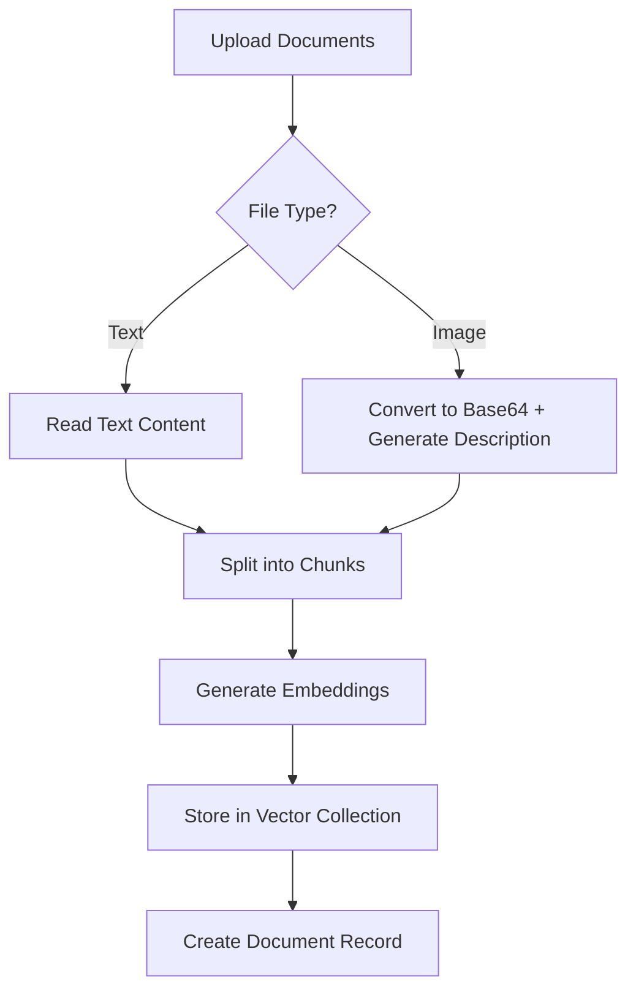

# Local Vector Store Architecture for DeepResearch

## Overview

This document describes the comprehensive local vector store implementation for the DeepResearch application, built using RxDB and transformers.js to provide a full RAG (Retrieval-Augmented Generation) pipeline that runs entirely in the browser.

## Architecture Components

### 1. Vector Store Core (`vector-store.js`)

The `VectorStore` class provides a complete local-first database solution for semantic search and document management.

#### Key Features:
- **Local Embeddings**: Uses transformers.js with Xenova/all-MiniLM-L6-v2 model
- **Multiple Data Types**: Documents, images, GitHub repositories
- **Semantic Search**: Vector similarity search with cosine similarity
- **Persistent Storage**: LocalStorage-based persistence (upgradeable to RxDB)
- **Real-time Processing**: Automatic embedding generation on upload

### 2. Collection Structure

The vector store uses a multi-collection architecture to organize different types of data:

```javascript
// Collection Structure Overview
{
  documents: Map(),      // Document metadata and content
  vectors: Map(),        // Vector embeddings for semantic search
  images: Map(),         // Image blobs and metadata
  repositories: Map(),   // GitHub repository information
  research_sessions: Map() // Research session context
}
```

#### Documents Collection
```javascript
{
  id: 'doc_timestamp_random',
  name: 'filename.ext',
  type: 'file' | 'image' | 'github_file',
  mimeType: 'text/plain',
  content: 'document content...',
  size: 1024,
  path: 'folder/file.txt', // For repository files
  repoId: 'repo_id',      // Reference to repository
  parentId: 'parent_id',  // For folder structure
  metadata: {
    originalName: 'file.txt',
    uploadedBy: 'user',
    tags: ['tag1', 'tag2']
  },
  createdAt: '2024-01-01T00:00:00.000Z',
  updatedAt: '2024-01-01T00:00:00.000Z'
}
```

#### Vectors Collection
```javascript
{
  id: 'vec_documentId_chunkIndex',
  documentId: 'doc_id',
  content: 'chunk of text that was embedded...',
  embedding: [0.1, 0.2, -0.3, ...], // 384-dimensional vector
  chunkIndex: 0,
  // Index fields for fast similarity search (optional optimization)
  idx0: 0.123,
  idx1: 0.456,
  idx2: 0.789,
  idx3: 0.012,
  idx4: 0.345,
  createdAt: '2024-01-01T00:00:00.000Z'
}
```

#### Images Collection
```javascript
{
  id: 'img_documentId',
  name: 'image.jpg',
  documentId: 'doc_id',
  blob: 'data:image/jpeg;base64,...', // Base64 encoded image
  mimeType: 'image/jpeg',
  size: 1048576,
  width: 1920,
  height: 1080,
  description: 'AI-generated description for search',
  createdAt: '2024-01-01T00:00:00.000Z'
}
```

#### Repositories Collection
```javascript
{
  id: 'repo_timestamp_random',
  name: 'repository-name',
  url: 'https://github.com/owner/repo',
  description: 'Repository description',
  structure: {
    type: 'directory',
    name: 'root',
    children: [
      {
        type: 'file',
        name: 'README.md',
        path: 'README.md',
        documentId: 'doc_id'
      },
      {
        type: 'directory',
        name: 'src',
        children: [...]
      }
    ]
  },
  fileCount: 50,
  processedFiles: 45,
  status: 'processing' | 'completed' | 'error',
  createdAt: '2024-01-01T00:00:00.000Z',
  updatedAt: '2024-01-01T00:00:00.000Z'
}
```

## RAG Pipeline Implementation

### 1. Document Ingestion



**Supported File Types:**
- **Text Files**: `.txt`, `.md`, `.js`, `.py`, `.html`, `.css`, `.json`, `.xml`, `.csv`
- **Images**: `.jpg`, `.jpeg`, `.png`, `.gif`, `.bmp`, `.webp`

**Text Chunking Strategy:**
- Documents are split into 500-word chunks
- Overlapping chunks for better context preservation
- Each chunk gets its own embedding vector

### 2. Vector Embedding Generation

```javascript
// Embedding Generation Process
async getEmbeddingFromText(text) {
  if (this.embeddingPipeline.mock) {
    // Development fallback
    return mockEmbedding(text);
  }
  
  const output = await this.embeddingPipeline(text, {
    pooling: 'mean',
    normalize: true
  });
  
  return Array.from(output.data); // 384-dimensional vector
}
```

**Model Details:**
- **Model**: Xenova/all-MiniLM-L6-v2
- **Dimensions**: 384
- **Performance**: ~173ms per embedding
- **Size**: 23MB download

### 3. Semantic Search

```javascript
// Search Implementation
async search(query, options = {}) {
  const queryEmbedding = await this.getEmbeddingFromText(query);
  
  const results = [];
  for (const [vectorId, vector] of this.collections.vectors) {
    const similarity = this.cosineSimilarity(queryEmbedding, vector.embedding);
    
    if (similarity >= options.minSimilarity) {
      results.push({
        documentId: vector.documentId,
        content: vector.content,
        similarity: similarity,
        document: this.collections.documents.get(vector.documentId)
      });
    }
  }
  
  return results.sort((a, b) => b.similarity - a.similarity);
}
```

**Search Parameters:**
- **Similarity Threshold**: 0.3-0.9 (configurable)
- **Results Limit**: 10 (configurable)
- **Search Scope**: All documents or filtered by IDs

### 4. Context-Aware Research Generation

The vector store integrates with the research generation process to provide relevant context:

```javascript
// Enhanced Research Prompt with Vector Context
async buildResearchPrompt(researchType, researchDepth) {
  // Search for relevant documents
  const allTopicsText = this.topics.map(t => `${t.title} ${t.description}`).join(' ');
  const relevantDocs = await this.vectorStore.search(allTopicsText, {
    limit: 5,
    minSimilarity: 0.3
  });
  
  // Include relevant context in prompt
  const contextSection = relevantDocs.map(doc => 
    `From "${doc.document.name}": ${doc.content.substring(0, 300)}...`
  ).join('\n\n');
  
  return `Research Topics: ${topicsList}
  
  Relevant Context:
  ${contextSection}
  
  Please incorporate insights from the context...`;
}
```

## User Interface Components

### 1. Document Upload Interface

- **Quick Upload**: Single button for immediate file selection
- **Drag & Drop**: Visual upload area with drag-over effects
- **Batch Processing**: Multiple file upload with progress tracking
- **File Type Validation**: Automatic filtering of supported formats

### 2. Knowledge Base Manager

```javascript
// Modal Features
- Vector Store Statistics (documents, embeddings, images, repos)
- Document List with metadata
- Search Interface for semantic queries
- Export/Import functionality
- Document preview and deletion
```

### 3. GitHub Repository Integration

**Status**: Coming Soon
- Repository URL input
- Recursive file processing
- Folder structure preservation
- Progress tracking for large repositories

## Performance Considerations

### 1. Embedding Generation

| Model | Time (ms) | Vector Size | Model Size |
|-------|-----------|-------------|------------|
| all-MiniLM-L6-v2 | 173 | 384 | 23MB |
| gte-small | 341 | 384 | 34MB |
| paraphrase-multilingual | 1000 | 768 | 279MB |

### 2. Storage Optimization

- **Embedding Compression**: Store as Float32Array for reduced size
- **Chunk Management**: Optimal 500-word chunks for balance
- **Lazy Loading**: Load embeddings on-demand for large datasets
- **Persistence**: LocalStorage for development, IndexedDB for production

### 3. Search Performance

```javascript
// Performance Optimizations
- Cosine Similarity: O(n) where n = vector dimensions
- Vector Indexing: Pre-computed distance indices for faster filtering
- Result Caching: Cache frequent queries
- Batch Processing: Process multiple queries together
```

## Future Enhancements

### 1. Advanced Features
- **Multi-modal Search**: Text + image queries
- **Cross-document Analysis**: Relationship mapping
- **Temporal Queries**: Time-based document filtering
- **Auto-tagging**: AI-generated document categories

### 2. GitHub Integration
- **Full Repository Processing**: Complete repo analysis
- **Branch Comparison**: Track changes across versions
- **Code Analysis**: Language-specific processing
- **Dependency Mapping**: Project structure analysis

### 3. Vector Store Optimizations
- **RxDB Migration**: Move from localStorage to RxDB
- **Vector Compression**: Dimensionality reduction
- **Distributed Storage**: Sharding for large datasets
- **Real-time Sync**: Multi-device synchronization

## API Reference

### Core Methods

```javascript
// Initialization
const vectorStore = new VectorStore();
await vectorStore.init();

// Document Management
const docId = await vectorStore.addDocument(file);
const documents = await vectorStore.getAllDocuments();
await vectorStore.deleteDocument(docId);

// Search
const results = await vectorStore.search('query', {
  limit: 10,
  minSimilarity: 0.7
});

// Statistics
const stats = vectorStore.getStats();

// Export/Import
const data = await vectorStore.exportData();
```

### Event Handling

```javascript
// Status Updates
vectorStore.onStatusChange = (message) => {
  console.log('Vector Store:', message);
};

// Progress Tracking
vectorStore.onProgress = (processed, total) => {
  console.log(`Progress: ${processed}/${total}`);
};
```

## Security and Privacy

### 1. Local-First Architecture
- **No External APIs**: All processing happens locally
- **Privacy by Design**: Data never leaves the device
- **Offline Capability**: Full functionality without internet
- **User Control**: Complete data ownership

### 2. Data Protection
- **Secure Storage**: Browser-native storage APIs
- **Memory Management**: Automatic cleanup of large objects
- **Error Handling**: Graceful failure recovery
- **Data Validation**: Input sanitization and type checking

## Troubleshooting

### Common Issues

1. **Embedding Model Not Loading**
   - Check internet connection for initial model download
   - Verify transformers.js CDN availability
   - Falls back to mock embeddings if unavailable

2. **Large File Processing**
   - Files over 10MB may cause memory issues
   - Consider chunking large documents
   - Monitor browser performance

3. **Search Quality Issues**
   - Adjust similarity threshold (0.3-0.9)
   - Try different search terms
   - Ensure documents are properly embedded

### Performance Tuning

```javascript
// Configuration Options
const vectorStore = new VectorStore({
  vectorIndexCount: 5,      // Number of index dimensions
  indexDistance: 0.003,     // Search precision
  docsPerIndexSide: 100,    // Results per index side
  chunkSize: 500,           // Words per chunk
  maxFileSize: 10 * 1024 * 1024 // 10MB limit
});
```

This architecture provides a robust foundation for local vector storage and semantic search, enabling powerful RAG capabilities while maintaining privacy and performance. 