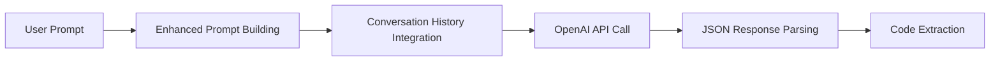
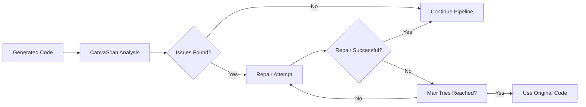
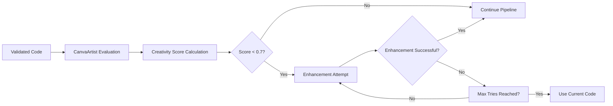
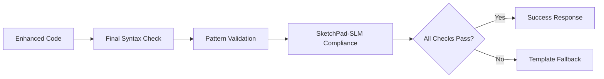

# SketchPad-SLM AI Agent System Documentation

## Overview
The SketchPad-SLM AI Agent System is a sophisticated multi-agent architecture designed to enhance p5.js code generation quality through automated analysis, repair, and creativity enhancement. The system consists of three core components working together to produce high-quality, visually stunning creative code.

## System Architecture

### 🎯 CanvaCore (Main Orchestrator)
**Role**: Central coordinator managing the entire code generation pipeline
**Responsibilities**:
- Orchestrates the complete code generation workflow
- Manages conversation history with OpenAI GPT models
- Handles initial code generation with enhanced prompts
- Coordinates between CanvaScan and CanvaArtist agents
- Provides fallback mechanisms when agents fail
- Tracks agent performance and metadata

**Key Features**:
- **Conversation Memory**: Maintains last 20 messages for context-aware generation
- **Enhanced Prompting**: Uses sophisticated prompts with examples and techniques
- **Multi-stage Pipeline**: 4-stage process (Generate → Scan → Enhance → Validate)
- **Fallback System**: Template-based generation when agents fail
- **Debug Logging**: Color-coded console logging for monitoring

### 🔍 CanvaScan (Code Analysis & Repair Agent)
**Role**: Code quality assurance and automatic repair specialist
**Responsibilities**:
- Analyzes generated code for syntax and pattern issues
- Detects SketchPad-SLM specific requirements violations
- Automatically repairs broken or non-compliant code
- Validates visual completeness and functionality

**Analysis Checks**:
```javascript
✅ Syntax validation using Function() constructor
✅ Required patterns: t=0, draw=, createCanvas
✅ Forbidden patterns: let/const declarations, complex transformations
✅ Visual completeness: fill/stroke, drawing commands
✅ SketchPad-SLM compliance: compact syntax requirements
```

**Repair Capabilities**:
- Fixes syntax errors while maintaining creative intent
- Converts complex code to compact SketchPad-SLM format
- Adds missing required components (canvas setup, time variables)
- Removes problematic patterns (let/const, push/pop transformations)
- **Max Attempts**: 2 repair tries per generation

### 🎨 CanvaArtist (Creativity Enhancement Agent)
**Role**: Visual quality and creativity optimization specialist
**Responsibilities**:
- Evaluates creativity score of generated code (0.0 - 1.0 scale)
- Identifies areas for visual enhancement
- Automatically improves code for better visual impact
- Adds sophisticated mathematical patterns and effects

**Creativity Scoring System**:
```javascript
Base Score: 0.3
+ Mathematical complexity (sin/cos): +0.2
+ Noise/randomness: +0.1
+ Multiple animation loops: +0.2
+ Time-based variations: +0.15
+ Visual richness (fill+stroke): +0.1
+ Dynamic colors: +0.15
+ Particle systems: +0.1
= Total Score (max 1.0)
```

**Enhancement Techniques**:
- **Wave Interference Patterns**: Complex mathematical interactions
- **Fibonacci Spirals**: Natural mathematical sequences
- **Fractal-like Patterns**: Self-similar recursive structures
- **Color Harmony**: HSB color space utilization
- **Multiple Time Scales**: t, t*2, t*0.5 variations
- **Layered Transparency**: Depth and visual richness
- **Threshold**: Enhances if creativity score < 0.7

## Pipeline Workflow

### Stage 1: Initial Code Generation


**Enhanced Prompt Features**:
- Advanced p5.js technique examples
- Mathematical pattern demonstrations
- Visual effect instructions
- Performance optimization guidelines
- Compact syntax requirements

### Stage 2: Code Analysis & Repair


**Issue Detection**:
- Syntax errors and runtime failures
- Missing SketchPad-SLM required patterns
- Forbidden language constructs
- Visual incompleteness

### Stage 3: Creativity Enhancement


**Enhancement Process**:
- Analyzes current visual patterns
- Generates improvement suggestions
- Applies advanced mathematical techniques
- Maintains performance and syntax compliance

### Stage 4: Final Validation


## Integration with SketchPad-SLM

### Activation
The agent system automatically activates when:
1. User connects to OpenAI API (any GPT model)
2. CanvaCore successfully initializes
3. User switches to Creative Mode

### Usage Flow
```javascript
1. User enters creative prompt
2. System checks: userAgreementAccepted && aiSession.type === 'openai' && canvaCore
3. If conditions met: Multi-agent pipeline activates
4. If not: Falls back to standard OpenAI generation
5. Results displayed with agent metadata
```

### Chat Integration
```javascript
// Agent status messages in chat:
"🎯 CanvaCore: Starting advanced multi-agent code generation pipeline..."
"🔍 CanvaScan: Code repair applied"
"🎨 CanvaArtist: Creativity enhanced"
"🔄 Agent tries: 2"
"⚠️ Fallback: Template system used"
```

## Configuration & Limits

### Agent Limits
- **Max Agent Tries**: 2 attempts per agent (excluding initial generation)
- **Conversation History**: Last 20 messages maintained
- **Temperature Settings**:
  - Initial Generation: 0.8 (creative)
  - Code Repair: 0.3 (conservative)
  - Creativity Enhancement: 0.9 (highly creative)

### Memory Management
- Automatic conversation history trimming
- Agent try count tracking
- Session-based storage (no persistence)
- Cleanup on AI disconnection

### Performance Optimization
- Parallel agent execution where possible
- Early termination on success
- Intelligent fallback mechanisms
- Minimal API calls (max 4 per generation)

## Error Handling & Fallbacks

### Agent Failure Scenarios
1. **CanvaScan Failure**: Uses original generated code
2. **CanvaArtist Failure**: Uses current code without enhancement
3. **Complete Pipeline Failure**: Falls back to template system
4. **API Errors**: Graceful degradation with user feedback

### Fallback Hierarchy
```
1. Multi-Agent Pipeline (OpenAI + CanvaCore)
    ↓ (if fails)
2. Standard OpenAI Generation (JSON format)
    ↓ (if fails)
3. Template System (Pattern matching)
    ↓ (if fails)
4. Default Creative Pattern
```

## Benefits & Improvements

### Code Quality Improvements
- **Syntax Reliability**: Automatic error detection and repair
- **Visual Richness**: Enhanced mathematical patterns and effects
- **Performance**: Optimized for 60fps smooth animation
- **Compliance**: Guaranteed SketchPad-SLM format compatibility

### User Experience Enhancements
- **One-Shot Quality**: Higher success rate on first generation
- **Creative Sophistication**: More visually impressive results
- **Transparency**: Clear feedback on agent actions
- **Reliability**: Multiple fallback mechanisms

### Technical Advantages
- **Conversation Context**: Builds on previous interactions
- **Iterative Improvement**: Each agent specializes in specific aspects
- **Scalable Architecture**: Easy to add new agents or capabilities
- **Monitoring**: Comprehensive logging and metadata tracking

## Future Enhancements

### Potential Agent Additions
- **CanvaOptimizer**: Performance and efficiency specialist
- **CanvaThemer**: Color palette and aesthetic coordinator
- **CanvaAnimator**: Advanced animation pattern specialist

### Advanced Features
- **Learning System**: Agent improvement based on user feedback
- **Style Transfer**: Apply artistic styles to generated code
- **Interactive Refinement**: User-guided enhancement process
- **Code Evolution**: Genetic algorithm-based code improvement

## Technical Implementation

### Files Structure
```
lib/agent/canvas.js          # Main agent system implementation
Canvas.html                  # Integration and UI handling
```

### Key Classes
```javascript
CanvaCore                    # Main orchestrator
├── generateCode()           # Primary pipeline method
├── initialCodeGeneration()  # Enhanced prompt generation
├── buildMessageHistory()    # Conversation management
└── validateFinalCode()      # Quality assurance

CanvaScan                    # Code analysis agent
├── analyzeCode()           # Issue detection
├── repairCode()            # Automatic fixing
└── calculateCreativityScore() # Quality metrics

CanvaArtist                  # Creativity enhancement agent
├── evaluateCreativity()     # Visual assessment
├── enhanceCreativity()      # Improvement application
└── generateSuggestions()    # Enhancement recommendations
```

### API Integration
- **OpenAI GPT Models**: 4.1-nano, 4o-mini, 4o, 4-turbo, 3.5-turbo
- **JSON Response Format**: Structured code and description extraction
- **Context Management**: Conversation history preservation
- **Error Recovery**: Multiple fallback strategies

This multi-agent system represents a significant advancement in automated creative coding, providing users with consistently high-quality, visually stunning p5.js animations while maintaining the compact, performance-optimized syntax that SketchPad-SLM requires.
